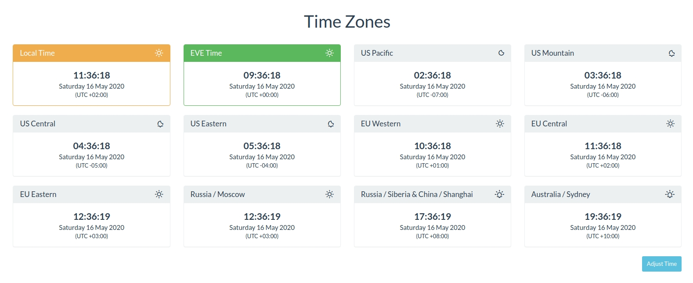

# AA Time Zones

App for displaying different time zones with Alliance Auth



## Contents

- [Installation](#installation)
- [Updating](#updating)
- [Additional Tinezone Panels](#additional-tinezone-panels)
- [Adjusting Time](#adjusting-time)
- [Change Log](CHANGELOG.md)

## Installation

**Important**: This app is a plugin for Alliance Auth. If you don't have Alliance Auth running already, please install it first before proceeding. (see the official [AA installation guide](https://allianceauth.readthedocs.io/en/latest/installation/auth/allianceauth/) for details)

### Step 1 - Install app

Make sure you are in the virtual environment (venv) of your Alliance Auth installation. Then install the newest release from PyPI:

```bash
pip install git+https://github.com/ppfeufer/aa-timezones.git
```

### Step 2 - Update Eve Online app

Configure your AA settings (`local.py`) as follows:

- Add `'timezones'` to `INSTALLED_APPS`


### Step 3 - Finalize installation into AA

Run migrations & copy static files

```bash
python manage.py collectstatic
python manage.py migrate
```

Restart your supervisor services for AA

### Step 4 - Setup permissions

Now you can setup permissions in Alliance Auth for your users. Add ``timezones|aa timezones|Can access ths app`` to the states and/or groups you would like to have access.

## Updating

To update your existing installation of AA Time Zones first enable your virtual environment.

Then run the following commands from your AA project directory (the one that contains `manage.py`).

```bash
pip install git+https://github.com/ppfeufer/aa-timezones.git --upgrade
```

```bash
python manage.py collectstatic
```

```bash
python manage.py migrate
```

Finally restart your AA supervisor services.

## Additional Tinezone Panels
Per default there are 10 additional time zone panels that are displayed (see first image). If you want to change those, you can do so by editing your `local-py` and override the default behaviour this way. So lets say you only want `US/Pacific` and `US/Mountain` as an example, here's how you do this.

Open your `local.py` in an editor of your choice and add the following at the end.

```python
# AA Time Zones
AA_TIMEZONES_ADDITIONAL_PANELS = [
    # US/Pacific
    {
        'timezoneName': 'US/Pacific',
        'panelTitle': 'US / Pacific',
        'panelId': 'us-pacific'
    },

    # US/Mountain
    {
        'timezoneName': 'US/Mountain',
        'panelTitle': 'US / Mountain',
        'panelId': 'us-mountain'
    },
]
```

Now there will be only these two defined paned be displayed, additionally to Local Time and EVE Time. The needed `timezoneName` you'll find in [this list](https://en.wikipedia.org/wiki/List_of_tz_database_time_zones#List), `panelTitle` is just the headline of the panel and `panelId` is a random letter string. Make sure `panelId` is unique for every panel.

**NOTE:** Local Time and EVE Time will always be displayed as the first two panels, no matter what.

## Adjusting Time

You can easiely adjust the time that is displayed for all timezones. This is useful for reinforcement timers or pre-planned fleets. To do so, click on the "Adjust Time" button below the time zone panels and you will see 2 different ways to set a new time.


The first one is meant for timers, like reinforcement timers, anchoring timers or the like. It's maximum is 7 day, 59 minutes and 59 seconds into the future. That should cover pretty much all timers you can find in Eve Online.

The second one is best suited for pre-planned fleets. Here you can set a fixed date and time based on the selected time zone. The default selected time zone is "EVE Time" but you can change it to all the available options. Keep in mind, the selected time zone is the one the time and date will be adjusted to. So if you are going to use it to plan fleets it is recommanded to keep this set to "EVE Time".

To set the adjusted time, simply click on "Set Time" in the row you altered. This will than adjust all time zone panels to the time you selected and will also alter the link in your browser, so you can share it with others directly.
